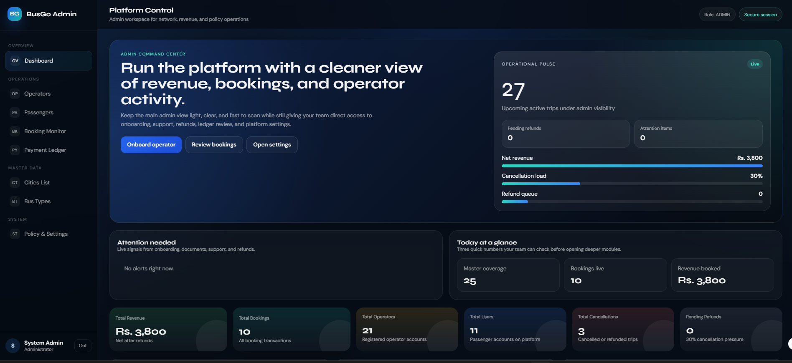
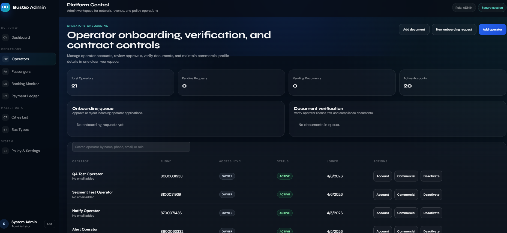
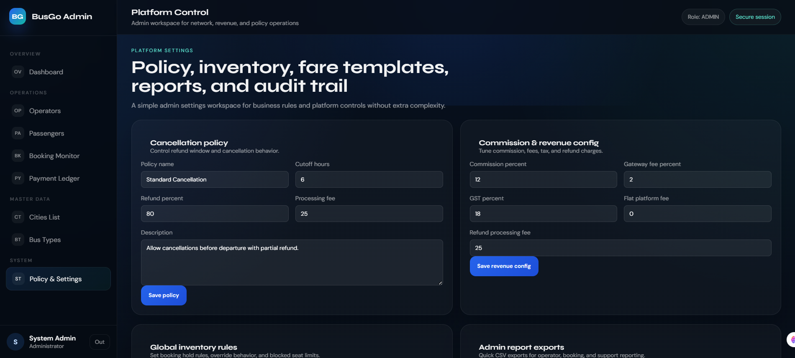
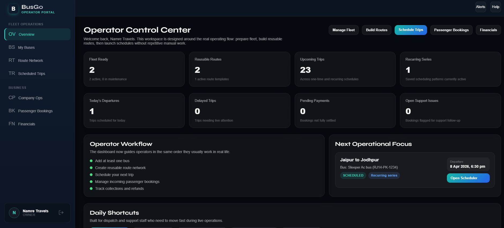
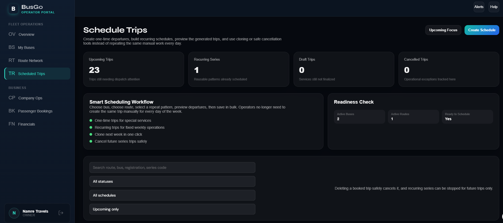
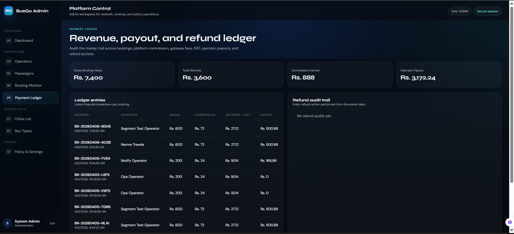
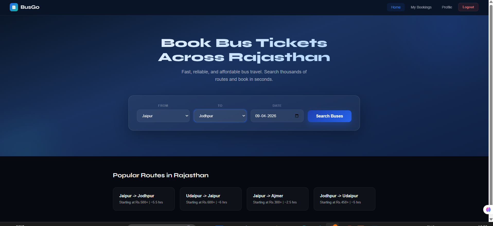
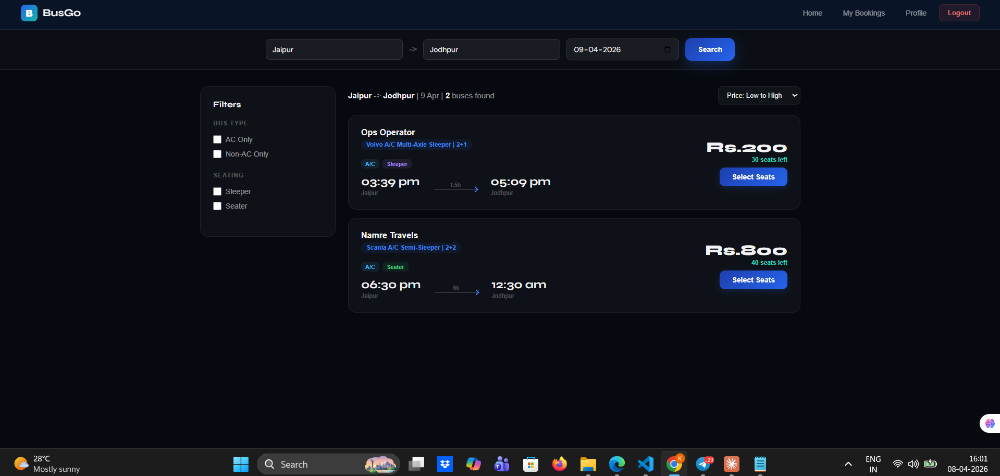
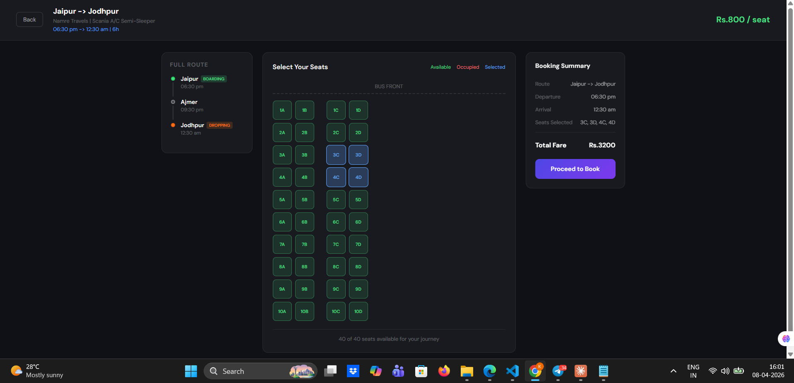

<div align="center">

# 🚌 BusGo — Bus Ticketing Platform

### A Full-Stack Bus Booking & Transport Operations Management System

<p align="center">
  
  
  
  
  
</p>

<p align="center">
  <b>Built for Admins, Operators, and Passengers</b><br/>
  Manage bookings, routes, fleets, trips, finance, support, and ticketing workflows in one platform.
</p>

</div>

---

## 📌 Overview

**BusGo** is a full-stack **bus ticketing and transport operations platform** designed to simulate a modern intercity bus service system.

It is built around **three primary user roles**:

- **Admin** — platform governance, operator onboarding, analytics, finance, support, and configuration
- **Operator** — fleet, buses, routes, trips, crew, and business operations
- **Passenger** — bus discovery, booking, seat selection, and ticketing experience

The project combines a **React + Vite frontend** with a **FastAPI backend** and a **MySQL database** to deliver a scalable and structured transport-tech application.

---

## ✨ Key Highlights

- 🔐 Multi-role authentication system (`ADMIN`, `OPERATOR`, `USER`)
- 📊 Admin dashboard for analytics, governance, and reporting
- 🏢 Operator workspace for managing buses, routes, and scheduled trips
- 🎫 Passenger booking flow with seat selection and ticketing
- 🛣️ **Intermediate-stop / segment-based booking support**
- 💰 Refund, cancellation, fare, and revenue control modules
- 🧾 Payment ledger, audit logs, alerts, and support workflows
- 📁 Structured full-stack architecture for future scalability

---

## 🧠 Core Modules

### 🔐 Authentication & Access Control
- Role-based login system
- Protected routes and secure access handling
- JWT-based authentication flow

### 👨‍💼 Admin Module
- Admin dashboard and operational overview
- Operator onboarding and approval workflow
- Operator document verification
- Platform analytics (bookings, users, revenue, cancellations, refunds)
- Booking monitoring and refund issue handling
- Payment ledger visibility
- Support ticket desk
- Fare template management
- Commission and revenue configuration
- Cancellation policy management
- Global inventory rules
- CSV export support
- Platform alerts and audit logs
- Master settings and system controls

### 🏢 Operator Module
- Operator dashboard and protected workspace
- Fleet and bus management
- Route and trip scheduling
- Passenger manifest visibility
- Company profile management
- Driver and crew assignments
- Blocked seat controls
- Operational support for scheduled services

### 🎫 Passenger / Booking Module
- Bus search and ticket booking flow
- Seat selection experience
- Ticket and booking record handling
- Refund-aware booking state logic
- Segment/intermediate-stop seat booking support

---

## 📸 Screenshots

<p align="center">
  
  
</p>

<p align="center">
  
  
</p>

<p align="center">
  
  
</p>

<p align="center">
  
  
</p>

<p align="center">
  
</p>

---

## 🛠️ Tech Stack

### Frontend
- **React 19**
- **Vite**
- **React Router**
- **Axios**
- **Custom CSS Design System**

### Backend
- **FastAPI**
- **SQLAlchemy**
- **Pydantic**
- **PyMySQL**
- **JWT Authentication**
- **Bcrypt Password Hashing**

### Database
- **MySQL**

---

## 📂 Project Structure

```text
BusGo-Bus-Ticketing-Platform/
├── backend/
│   ├── app/
│   │   ├── main.py
│   │   └── modules/
│   │       ├── admin/
│   │       ├── auth/
│   │       ├── booking/
│   │       └── operator/
│   ├── alembic/
│   ├── create_admin.py
│   ├── seed_masters.py
│   └── requirements.txt
├── docs/
│   └── screenshots/
├── frontend/
│   ├── src/
│   │   ├── api/
│   │   ├── layouts/
│   │   ├── modules/
│   │   └── router/
│   └── package.json
├── LICENSE
└── README.md
```

---

## 🚀 Getting Started

### 1️⃣ Clone the Repository

```bash
git clone https://github.com/Krishnagodhwani/BusGo-Bus-Ticketing-Platform.git
cd BusGo-Bus-Ticketing-Platform
```

---

## ⚙️ Backend Setup

```bash
cd backend
python -m venv venv
venv\Scripts\activate
pip install -r requirements.txt
```

Create a `.env` file inside the backend directory and configure your **MySQL database connection** before running the API.

### ▶️ Run Backend

```bash
uvicorn app.main:app --reload
```

Backend will run at:

```text
http://127.0.0.1:8000
```

---

## 👑 Create Admin Account

```bash
python create_admin.py
```

Default development admin credentials:

```text
Phone: 9999999999
Password: admin123
Role: ADMIN
```

> ⚠️ Recommended: Change default credentials before production use.

---

## 🌱 Seed Master Data

```bash
python seed_masters.py
```

---

## 💻 Frontend Setup

```bash
cd ../frontend
npm install
npm run dev
```

Frontend will run at:

```text
http://localhost:5173
```

---

## 📜 Available Scripts

### Frontend

```bash
npm run dev
npm run build
npm run preview
```

### Backend

```bash
uvicorn app.main:app --reload
python create_admin.py
python seed_masters.py
```

---

## 🔌 API Overview

The FastAPI application mounts routers under:

```text
/api/v1
```

### Main Backend Modules

- `auth` — login, registration, authentication, and operator creation
- `admin` — governance, analytics, configuration, and monitoring
- `operator` — fleet, routes, trips, and operational workflows
- `booking` — reservation, seats, and ticketing logic

### Health Check Endpoint

```text
GET /health
```

---

## 📈 Current Status

### Implemented Features

- ✅ Admin dashboard and platform controls
- ✅ Operator onboarding and management workflows
- ✅ Booking monitoring and refund controls
- ✅ Support ticket desk
- ✅ Fare templates and inventory rules
- ✅ Company profile and crew workflows
- ✅ Blocked seat workflows
- ✅ CSV report exports
- ✅ Audit logs and alerts

---

## 🎯 Project Vision

BusGo is designed as more than a simple bus booking interface.

It focuses on creating a **real-world transport operations system** by covering:

- platform governance
- operator lifecycle management
- trip and route operations
- passenger and booking workflows
- refund and financial visibility
- configurable business logic
- support and operational oversight

This makes it a stronger product architecture compared to a basic CRUD booking project.

---

## 🧪 Future Enhancements

Potential future improvements for the platform:

- Online payment gateway integration
- Real-time seat locking
- Live bus tracking
- SMS / Email ticket notifications
- QR-based ticket verification
- Advanced analytics and reporting dashboards
- Role-based permissions expansion
- Deployment and CI/CD pipeline support

---

## 🤝 Contributing

Contributions, ideas, and improvements are welcome.

If you'd like to contribute:

1. Fork the repository
2. Create a feature branch
3. Make your changes
4. Commit your work
5. Open a pull request

---

## 📄 License

This project is licensed under the **MIT License**.
See the [LICENSE](LICENSE) file for details.

---

<div align="center">

### ⭐ If you found this project useful, consider giving it a star

</div>
